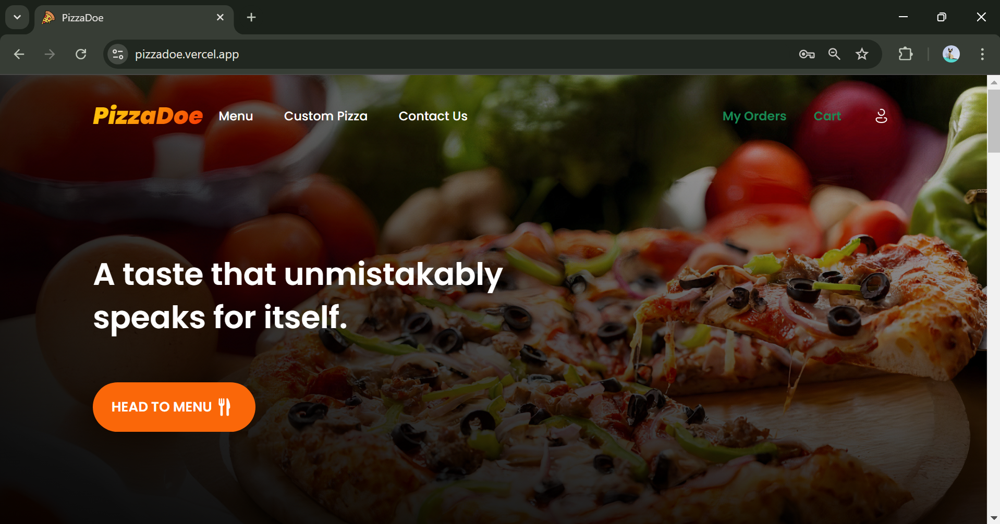
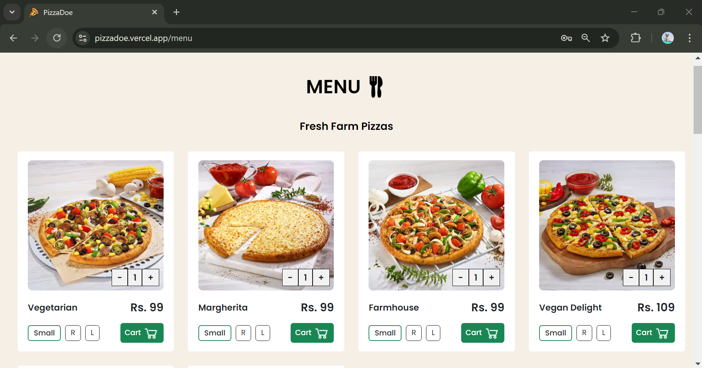
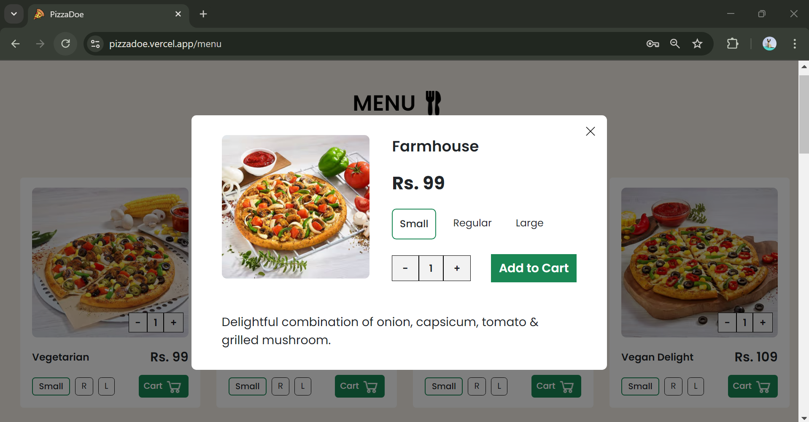
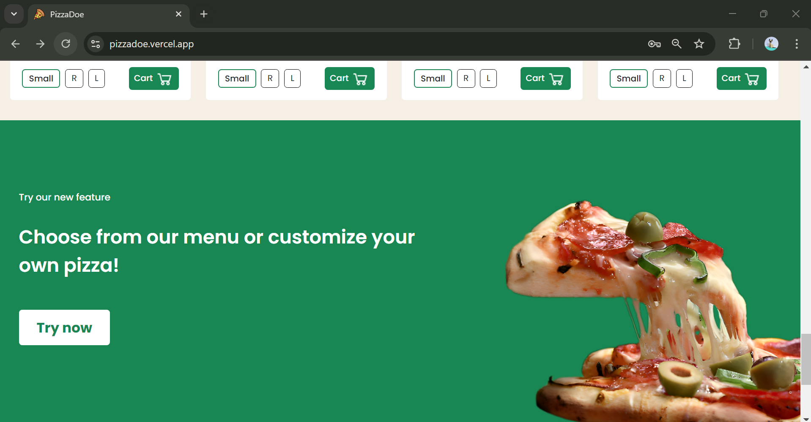
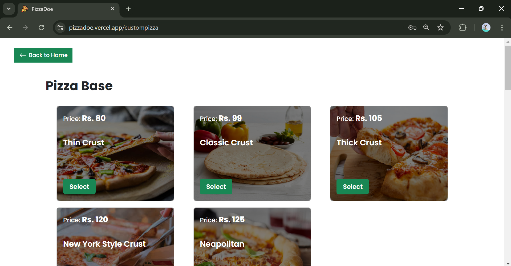
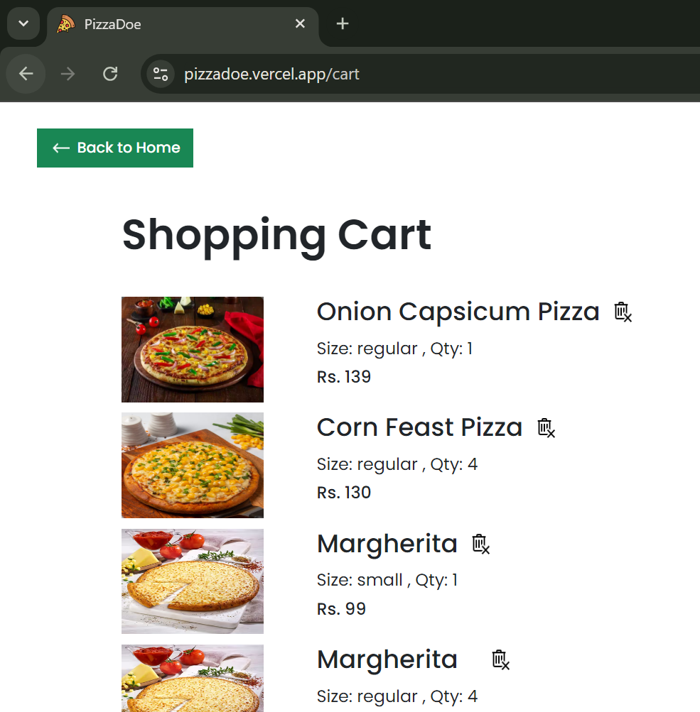
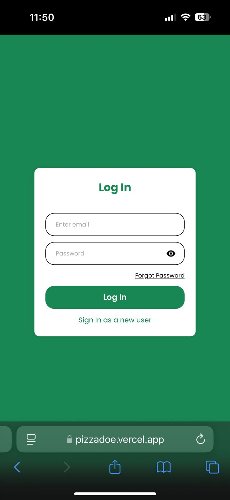
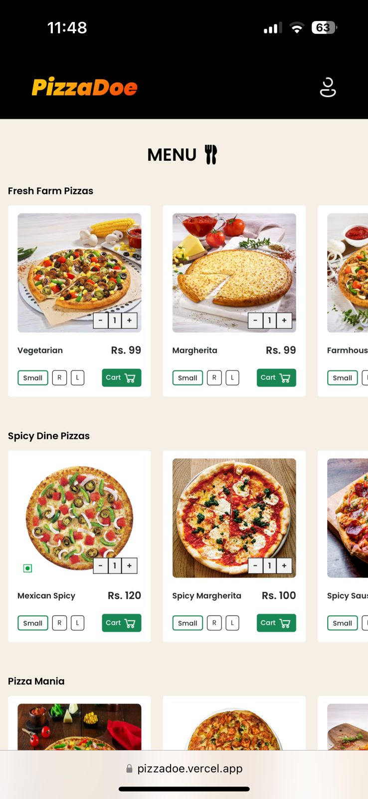

# Pizzadoe – Pizza Ordering Platform  

> A seamless, feature-rich pizza delivery app built with the **MERN stack**, designed to enhance the pizza ordering experience with customization, cart management, and secure payments.  

  

**Live Demo:** [Pizzadoe Demo](https://pizzadoe.vercel.app/) (maintenance ongoing)  
**Tech Stack:**  
  
  
  
  
  
  
  

## Features at a Glance  

### User-Friendly Interface  
A clean and intuitive interface designed for a seamless pizza ordering experience.  
- Minimalist UI with easy-to-navigate sections.  

**Screenshot:**  
  

---

### Pizza Menu Browsing  
Browse a wide range of pizzas, categorized for convenience.  
- View detailed descriptions and ingredients.  
- Easily filter by **Veg / Non-Veg**, price, or popularity.  

**Screenshots:**  
  
  

---

### Fully Customizable Pizzas  
Design your perfect pizza with a variety of customization options!  
- Choose your base – Thin crust, deep dish, gluten-free, etc.  
- Select your sauce – Marinara, BBQ, white garlic, and more.  
- Add your favorite toppings – Fresh veggies, meats, extra cheese.  

**Screenshots:**  
  
  

---

### Seamless Cart Management  
Keep track of your order before checking out.  
- Add/remove items effortlessly.  
- Adjust quantity with a single tap.  
- Real-time cart price calculation.  

**Screenshot:**  
  

---

### Secure Payment Integration  
Integrated **RazorPay** for fast & secure transactions.  
- Supports multiple payment methods (UPI, Cards, Net Banking).  
- Test mode enabled for demo purposes.  

**Screenshot:**  
  

---

### Responsive Design  
Enjoy a seamless experience across all devices.  
- Optimized for **mobile, tablet, and desktop screens**.  

**Mobile View:**  

   
   

  

---

## Technologies Used  

| Category           | Tech Stack              |  
|-------------------|------------------------|  
| Frontend         | React.js, Tailwind CSS  |  
| State Management | Redux                   |  
| Backend          | Node.js, Express.js     |  
| Database         | MongoDB                 |  
| Authentication   | Custom Authentication   |  
| Payments        | RazorPay API            |  

---

## ⭐ **Like This Project? Support & Connect!**  
If you find this project useful, don’t forget to **⭐ Star** the repo!  

More about me:  
💻 **Portfolio:** [@ayunarang](https://ayushinarang.vercel.app) 
🔗 **LinkedIn:** [@ayushinarang](https://linkedin.com/in/ayushinarang)  

